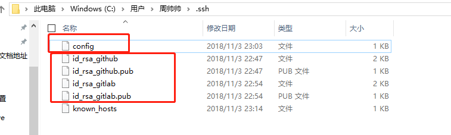
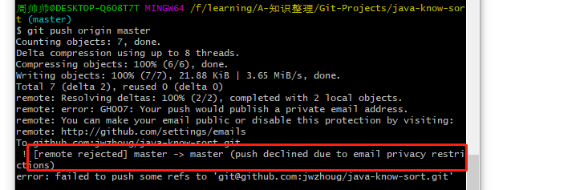
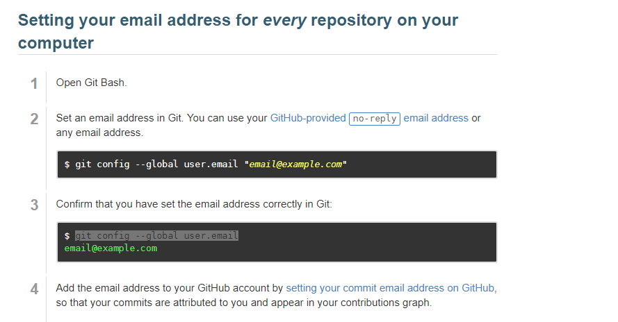
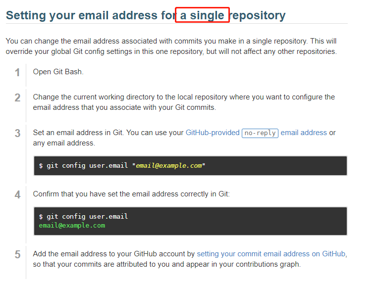

### git登陆设置

[多账号git管理](https://www.cnblogs.com/popfisher/p/5731232.html)

生成对应的各个账号的公私钥信息，减少重复性登陆操作。

【config】配置

####  1.1 配置github.com

Host github.com
​	HostName github.com
​	IdentityFile c:\Users\周帅帅\.ssh\id_rsa_github
​    PreferredAuthentications publickey
​    User jwzhoug

####  1.2 配置gitlab.com

Host git.gupaoedu.com
​	HostName git.gupaoedu.com
​	IdentityFile c:\Users\周帅帅\.ssh\id_rsa_gitlab
​    PreferredAuthentications publickey
​    User lalalala

#### 2. 私钥信息添加到ssh-agent高速缓存

【将私钥添加到 ssh-agent的告诉缓存中】

$ ssh-agent bash
//A账户的私钥
$ ssh-add ~/.ssh/id_rsa
//B账户的私钥
$ ssh-add ~/.ssh/lapisy_id_rsa

#### 3. user.email 信息追加

[参考网页信息](https://blog.csdn.net/ontheroadtomine/article/details/79029331)

【推送失败】

修改要改对应的github中 email的属性为public。

修改email属性

