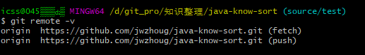
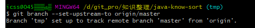
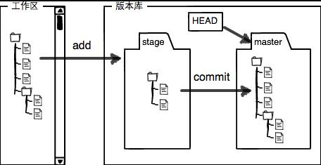
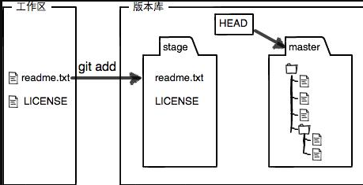
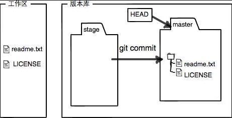

### Git

整理对应得常规可用得git操作，提高工作效率。


### 1. 分支管理


#### 1.1 分支常规操作

本地创建分支，与远程分支建立联系。

* `git branch`  查看本地分支
* `git branch -r`  查看远程分支
* `git branch -a`  查看本地和远程分支
* `git branch [dev]`  创建本地分支
* `git push origin [source/test | dev]`  把 本地分支 推送到远端
* `git check out [source/test]`  切换分支
* `git branch -d [dev]`   删除本地分支
* `git remote -v`  获取远端git地址



*  `git status`  获取本地状态
* `git add`  将修改点添加到 暂存器
* `git commit -m "message"`  提交到本地版本库
* `git push origin [remote_name]`  将本地归档变更点 推送到远程分支


#### 1.2 分支间代码合并

本质实现是依赖于本地版本库进行本地分支间的代码同步。

**执行步骤**

1. `git branch -a`  查看分支信息
2. `git checkout [source/test]`  切换到版本高的分支
3. `git log `  查看对应的高版本的commit点，获取commitId信息
4. `git checkout master`  切回低版本的分支
5. `git cherry-pick [commitId]`  将指定commitId的修改同步到当前分支
6. `git push origin master`  将同步过来的新版本库，同步到远程分支。


### 2. 日志

**命令酌情可组合使用**

####  2.1 查看日志

* `git log`   通用查看提交信息
* `git log -[length]`   查看指定数量得日志
* `git log --oneline`  日志信息以一条记录得形式进行输出
* `git log --skip=[skip]`   跳过指定数量得日志
* `git log --pretty=raw`   获取详细的日志信息（包含修改内容【具体】）
* `git log --graph`    绘制提交线状态【直观的看出，commit点的变化】
* `git log --decorate`  参数用来显示一些相关信息，【HEAD、分支名、tag名】
* `git tag xxxx [commit_id]`   给指定提交点，打标签
* `git log --name-status`   查看每次提交对应的文件改动信息


####  2.1 **搜索日志**

* `git log --author [authorName]`   搜指定人的提交日志
* `git log --grep [检索内容]`   可以用来检索提交的comment信息
* `git log -p -- [文件名（携带路径）]`   搜索指定文件的提交日志
* `git log -S "https://www.jfh.com/codedoctorw"`  搜索指定内容得提交点


###  3. 提交

将暂存区里得改动提交到本地得版本库。每次使用 `git commit` 命令都会在本地版本库生成一个40位的哈希值，这个哈希值也叫`commit-id`。

* `git commit -m "message"`  
* `git commit -a -m "message"`  将包括未进入暂存区的修改，直接提交到本地版本库。【**不推荐使用该方法**，请老实的将 文件 `git add [文件名]` 的方式提交到暂存区】
* `git commit --amend`  将修改文件合入到上一次的commit记录中。

【回退 git add 后状态】

`use "git reset HEAD <file>..." to unstage`

【添加文件/还原文件在版本库中得状态】

`(use "git add <file>..." to update what will be committed)
  (use "git checkout -- <file>..." to discard changes in working directory)`


###  4.  版本回退

版本回退，多出现在当前版本超前问题。

* `git reset --hard [HEAD/commit点确认]`  版本回退到指定的提交点。【**回退后数据会缺失，注意备份中间段提交的修改文件**】


### 5. git fetch VS git pull

两者都是可以将远程仓库的更新至本地的操作。

####  5.1 **`git pull`命令**

作用：取回远程主机某个分支的更新，再与本地的指定分支合并

格式: `git pull <远程主机名> <远程分知名>:<本地分支名>`

1. 如果与当前分支合并，可省略本地分支名。

   `git pull <远程主机名> <远程分知名>`

   相当于：

   	`git fetch <远程主机名> <远程分支名>`
		
   	`git merge <远程主机名>/<远程分支名>`

2. 如果当前分支与远程分支存在追踪关系

   `git pull <远程主机名>`

3. 如果当前分支只有一个追踪关系

   `git pull`

4. 手动建立追踪

   `git branch --set-upstream-to origin/master`

   

   执行完成后，会反馈对应的绑定关系成立。相当于当前本地版本库中 master/tmp 分支都关联到了远程分支 origin/master 下。


#### 5.2 `git fetch` 命令

1. `git fetch origin master:[tmp]`  

在本地创建一个tmp分支，并将远程origin仓库master分支代码下载到本地tmp分支

2. `git diff [tmp]`

   比较当前分支与本地分支 tmp的差异。

3. `git merge [tmp]`

   合并tmp分支到本地的master分支


### 6. 撤销工作区修改

`git checkout -- [file]`   注意追加 `--` 修饰，不然会出现对应的切换分支。


--------------------


### 7. 常见问题

#### 7.1 删除分支

`git push origin [remote:tmp]`  push推送失败的情况下，

`git branch -d [tmp]`    执行删除分支动作，可能会提示信息，执行以下操作，强制执行。

`git branch -D [tmp]`    强制删除本地分支


-------------------------------------------------------


### 8. 全套系列

#### 8.1 创建本地仓

`git init`  将本地目录初始化

#### 8.2 时光机穿梭

##### 8.2.1 版本回退

`git reset --hard HEAD^`    HEAD^ = commitId，对应的回退当指定提交点

##### 8.2.2 工作区和暂存区

工作区有一个隐藏目录`.git` ,这个不算工作区，而是Git的版本库。

Git的版本库里存了很多东西，其中最重要的就是称为Stage（或者Index）的暂存区，还有Git为我们自动创建的第一个分支`master` ,以及指向`master`的一个指针叫`HEAD`。




* `git status`
* `git add [fileName]`



* `git commit -m "message"`




##### 8.2.3 管理修改

`git diff HEAD -- [fileName]`  查看文件，工作区与版本库之间的差异。


##### 8.2.4 撤销修改

* `git status`
* `git checkout -- [fileName]`  撤销工作区的修改 | 相当于可视化的 `revert` 操作


##### 8.2.5 删除文件

* `dir`  当前目录下的文件
* `rm [fileName]`  删除指定文件
* `git status`  确认文件被删除状态
* `git commit -m "message"`   删除状态提交


* `git rm [fileName]`    删除文件
* `git checkout -- [fileName]`  因为版本库中已存在文件，这么执行可以还原被删除原件。

**注意**：还原版本库中的文件，工作区的修改事项不会存在。(需要按照修改记录进行代码的重新修改）


#### 8.3 远程仓库

##### 8.3.1 添加远程库

* `git init`
* `git remote add origin [github.address]`  将本地仓关联远程仓
* `git branch dev` 创建dev分支
* `git checkout dev`  切换到dev分支
* `git add *`  + `git commit -m "message"` 修改提交
* `git push origin [dev]`   将修改的本地仓数据，推送到远程仓中对应的分支。

##### 8.3.2 从远程克隆

github创建仓

`git clone [github.address]`  克隆对应仓的代码到本地，并创建master分支

#### 8.4 分支管理

##### 8.4.1 创建与分支合并

* `git branch -b [dev]`   创建并切换到 【dev】分支
* `git branch dev`   +  ` git checkout dev`    跟上面操作功能一致
* `git diff [tmp]`   比较tmp本地仓，与当前本地仓的差异
* `git merge [tmp]`  合并tmp分支到当前分支
* `git branch -d [tmp]`  删除对应的分支

##### 8.4.2  解决冲突

```java
$ git merge feature1
Auto-merging readme.txt
CONFLICT (content): Merge conflict in readme.txt
Automatic merge failed; fix conflicts and then commit the result.
```

执行分支合并时，出现冲突问题。

`git status`

```java
$ git status
On branch master
Your branch is ahead of 'origin/master' by 2 commits.
  (use "git push" to publish your local commits)

You have unmerged paths.
  (fix conflicts and run "git commit")
  (use "git merge --abort" to abort the merge)

Unmerged paths:
  (use "git add <file>..." to mark resolution)

    both modified:   readme.txt

no changes added to commit (use "git add" and/or "git commit -a")
```

出现类似提示信息，提示 readme.txt 冲突。

我们可以直接查看readme.txt的内容：

```txt
Git is a distributed version control system.
Git is free software distributed under the GPL.
Git has a mutable index called stage.
Git tracks changes of files.
<<<<<<< HEAD
Creating a new branch is quick & simple.
=======
Creating a new branch is quick AND simple.
>>>>>>> feature1
```

  Git用`<<<<<<<`，`=======`，`>>>>>>>`标记出不同分支的内容，我们修改如下后保存：

【修改冲突文件信息】

`git add *`

`git commit -m "conflict fixed"`   解决冲突问题。

`git push origin [feature1]`

##### 8.4.3 分支管理策略

通常，合并分支时，如果可能，Git会用`Fast forward`模式，但这种模式下，删除分支后，会丢掉分支信息。

如果要强制禁用`Fast forward`模式，Git就会在merge时生成一个新的commit，这样，从分支历史上就可以看出分支信息。

`git merge --no-ff -m "merge with no-ff" [dev]`    注意`--no-ff`参数，表示禁用`Fast forword`


##### 8.4.4 Bug分支

软件开发中，bug修复时，都可以创建一个临时分支 来修复，修复后，合并分支，然后将临时分支删除。

`git stash` 功能，可以把当前工作现场“储藏”起来，等以后恢复现场后继续工作。

* `git checkout -b [issue-001]`
* `git add *`  +   `git commit -m "message"`   bug分支 修改并提交
* `git merge --no-ff -m "merge with issue-001" [issue-001]`  合并bug分支


* `git stash pop`  还原原工作区

【提示】

* `git stash list`   可以查看工作区中隐藏的文件
* `git stash apply`   恢复原工作环境，但是 stash内容并不删除。
* `git stash pop`   需要执行此命令，取出stash，并删除stash


 ##### 8.4.5 Feature分支

新功能分支，其实 与 bug分支有着相似的操作。

但是如果新功能取消，要删除Feature分支时。

```java
$ git branch -d feature-vulcan
error: The branch 'feature-vulcan' is not fully merged.
If you are sure you want to delete it, run 'git branch -D feature-vulcan'.
```

可能会提示分支还没merge，不能被删除，可以采用以下强制删除。

`git branch -D [feature]`


##### 8.4.6 多人协作

`git remote`  查看远程库信息

`git remote -v`  显示远程库更详细信息

【推送分支】

`git push origin [dev]` 

【抓取分支】

小伙伴要在dev分支上开发，就必须创建远程 `origin` 的 `dev` 分支到本地，

`git checkout -b dev origin/dev`    从远程获取代码，创建本地dev分支。

【修改完成后，本地往远程推送异常时】

```java
$ git push origin dev
To github.com:michaelliao/learngit.git
 ! [rejected]        dev -> dev (non-fast-forward)
error: failed to push some refs to 'git@github.com:michaelliao/learngit.git'
hint: Updates were rejected because the tip of your current branch is behind
hint: its remote counterpart. Integrate the remote changes (e.g.
hint: 'git pull ...') before pushing again.
hint: See the 'Note about fast-forwards' in 'git push --help' for details.
```

该提示信息，说明当前远程仓已经有人提交新的代码了。此时我们需要从远程仓更新最新代码。

`git pull origin [dev]`

本地仓代码会进行合并，如果有冲突，需要解决 conflix。

【如果pull代码失败】

```java
$ git pull
There is no tracking information for the current branch.
Please specify which branch you want to merge with.
See git-pull(1) for details.

    git pull <remote> <branch>

If you wish to set tracking information for this branch you can do so with:

    git branch --set-upstream-to=origin/<branch> dev
```

**原因**：没有指定本地`dev`分支与远程`origin/dev`分支的链接，根据提示信息

`git branch --set-upstream-to=origin/dev dev` 

`git pull origin dev`

然后再解决本地代码合并冲突的问题。


##### 8.4.7 Rebase

将 多线纪录 -> 线性纪录  

```java
$ git log --graph --pretty=oneline --abbrev-commit
*   e0ea545 (HEAD -> master) Merge branch 'master' of github.com:michaelliao/learngit
|\  
| * f005ed4 (origin/master) set exit=1
* | 582d922 add author
* | 8875536 add comment
|/  
* d1be385 init hello
...
```


【diff】

```java
$ git rebase
First, rewinding head to replay your work on top of it...
Applying: add comment
Using index info to reconstruct a base tree...
M    hello.py
Falling back to patching base and 3-way merge...
Auto-merging hello.py
Applying: add author
Using index info to reconstruct a base tree...
M    hello.py
Falling back to patching base and 3-way merge...
Auto-merging hello.py
```


#### 8.5 标签管理

##### 8.5.1 创建标签

* `git checkout dev`   切换到需要打标签的分支
* `git tag <name>`  打标签
* `git tag`   查看标签


默认标签是打在最新提交的commit上的。**如果想要更换时间点打标签？** 

```java
$ git log --pretty=oneline --abbrev-commit
12a631b (HEAD -> master, tag: v1.0, origin/master) merged bug fix 101
4c805e2 fix bug 101
e1e9c68 merge with no-ff
f52c633 add merge
cf810e4 conflict fixed
5dc6824 & simple
14096d0 AND simple
b17d20e branch test
d46f35e remove test.txt
b84166e add test.txt
519219b git tracks changes
e43a48b understand how stage works
1094adb append GPL
e475afc add distributed
eaadf4e wrote a readme file
```

查询提交的所有commitId

`git tag v1.o [commitId]`   将标签打在指定的commit点上。

`$ git tag -a v0.1 -m "version 0.1 released" 1094adb`  打的标签，携带message信息

【展示标签信息】

`git show <tagName>`   展示对应标签名，具体携带信息。


##### 8.5.2 操作标签

* `git tag -d <tagName>`   删除标签
* `git push origin [dev] [tagName] `   创建的标签都只存储在本地，不会自动推送的远程。执行命令推送到远程。
* `git tag -d <tagName>`
* `git push origin :refs/tags/<tagName>`   从远程删除标签


